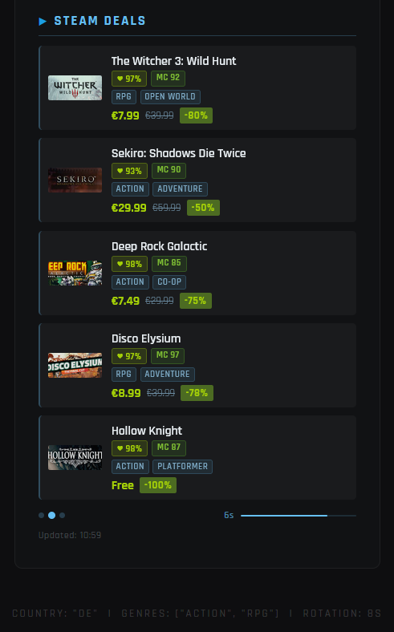

# MMM-SteamDeals

A MagicMirror² module that displays current Steam deals fetched from the free **CheapShark API**. Built as a companion to **MMM-SteamUpcoming**, it reuses the same genre filter, country/region filter, rotation, and visual design.  
No API key required.
This module was vibe coded with Anthropic's Claude AI - Sonnet 4.6. Please feel free to adapt it / improve it / make suggestions.

---

## Screenshot



---

## Features

- Deals via **CheapShark API** (free, no key required)
- **Genre filter** – show only games of specific genres
- **Sort by popularity, rating, savings, price** and more
- **Minimum Steam / Metacritic rating** filters
- **Automatic rotation** – cycles through all loaded deals
- Game covers, discount badge, page indicator
- **Language support**: `"en"` or `"de"`
- Fully configurable via `config.js`

---

## Installation

```bash
cd ~/MagicMirror/modules
git clone https://github.com/badubada/MMM-SteamDeals.git
# No npm install needed on Node 18+ (native fetch is used).
# Only required for Node < 18:
# cd MMM-SteamDeals && npm install node-fetch@2
```

---

## Configuration

Add the following block to `~/MagicMirror/config/config.js`:

```js
{
  module:   "MMM-SteamDeals",
  position: "top_right",
  config: {
    language:         "en",         // "en" | "de"
    maxDeals:         5,
    minDiscount:      50,
    maxPrice:         15,

    // Sort by popularity (Steam reviews) with minimum rating
    sortBy:           "Reviews",
    minSteamRating:   75,

    // Genre filter
    genres:           ["Action", "RPG"],

    // Rotation
    rotationEnabled:  true,
    rotationInterval: 10 * 1000,
    rotationShowPage: true,
  }
},
```

The full reference for all options and genre values is in **`config.example.js`**.

---

## Configuration options

| Option             | Type    | Default        | Description                                        |
|--------------------|---------|----------------|----------------------------------------------------|
| `language`         | String  | `"en"`         | UI language: `"en"` or `"de"`                      |
| `title`            | String  | `"Steam Deals"`| Module heading                                     |
| `maxDeals`         | Number  | `5`            | Deals shown per page                               |
| `showCovers`       | Boolean | `true`         | Show cover thumbnails                              |
| `showSavings`      | Boolean | `true`         | Show discount badge                                |
| `minDiscount`      | Number  | `50`           | Minimum discount in % (0 = off)                    |
| `maxPrice`         | Number  | `15`           | Max original price in USD (0 = off)                |
| `minSteamRating`   | Number  | `0`            | Minimum Steam review score 0–100 (0 = off)         |
| `minMetacritic`    | Number  | `0`            | Minimum Metacritic score 0–100 (0 = off)           |
| `sortBy`           | String  | `"Deal Rating"`| Sort order (see table below)                       |
| `sortDescending`   | Boolean | `true`         | `true` = best/highest first                        |
| `genres`           | Array   | `[]`           | Genre filter (empty = all genres)                  |
| `rotationEnabled`  | Boolean | `false`        | Enable automatic page cycling                      |
| `rotationInterval` | Number  | `10000`        | Time per page in ms                                |
| `rotationShowPage` | Boolean | `true`         | Show "1 / 3" page indicator                        |
| `updateInterval`   | Number  | `1800000`      | How often to fetch fresh data (ms, min. 15 min)    |
| `animationSpeed`   | Number  | `1000`         | Fade-in duration in ms (0 = instant)               |

### sortBy values

| Value          | Description                                       |
|----------------|---------------------------------------------------|
| `"Deal Rating"`| CheapShark composite score (default)              |
| `"Savings"`    | Highest discount first                            |
| `"Price"`      | Lowest sale price first                           |
| `"Reviews"`    | Highest Steam user review score → **popularity**  |
| `"Metacritic"` | Highest Metacritic score → **critic rating**      |
| `"Release"`    | Newest releases first                             |
| `"recent"`     | Most recently updated deals first                 |
| `"Title"`      | Alphabetical                                      |

---

## APIs used

| API | Purpose |
|-----|---------|
| [CheapShark](https://apidocs.cheapshark.com/) | Deal data, prices, covers, sorting, rating filters |
| [Steam Store API](https://store.steampowered.com/api/appdetails) | Genre information (only when genre filter is active) |

---

## Requirements

- MagicMirror² v2.x
- Node.js ≥ 18 (native `fetch` is used — no `npm install` needed)  
  For Node < 18: `npm install node-fetch@2` inside the module folder

---

## Disclaimer

MMM-SteamDeals is an independent, community-developed module for MagicMirror² and is not affiliated with, endorsed by, or in any way officially connected to Valve Corporation or the Steam platform. All trademarks, service marks, trade names, product names, and logos — including "Steam" — are the property of their respective owners.
Deal data is sourced from the third-party CheapShark API. Game titles, prices, cover images, and ratings are the property of their respective publishers and developers. This module does not store, redistribute, or monetise any of that data — it is fetched at runtime solely for personal, non-commercial display purposes.
Use of the Steam Store API is subject to Valve's Steam Web API Terms of Use.

---

## License

MIT

